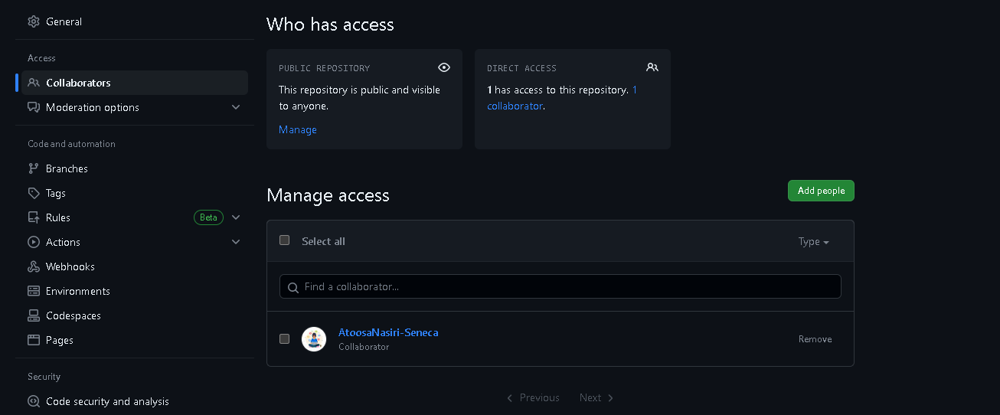

# Checkpoint1 Submission

- **COURSE INFORMATION: CSN400-2234**
- **STUDENT’S NAME: Soufiane Berni**
- **STUDENT'S NUMBER: 108170218**
- **GITHUB USER_ID: 108170218-myseneca** 
- **TEACHER’S NAME: Atoosa Nasiri**

### Table of Contents
- [My Image](#my-image)
- [Single line code snippet](#single-line-code-snippet)
- [Multi line code snippet](#multi-line-code-snippet)
- [Sample json objects](#sample-json-objects)
- [Sample table](#sample-table)
- [Sample hyperlink](#sample-hyperlink)

### My Image
This is my collaboration image


### My Single Line of Code
this is my single of code `assign 1`

#### Single line code snippet.
When we add ~~ text ~~ in our README.md file this creates
strikethrough

#### Multi line code snippet.
**This is bold text**
```
<!DOCTYPE html>
<html>
  <head>
    <title>My HTML Page</title>
  </head>
  <body>
    <h1>Welcome to my HTML Page</h1>
    <p>This is a paragraph of text.</p>
    <ul>
      <li>List item 1</li>
      <li>List item 2</li>
      <li>List item 3</li>
    </ul>
  </body>
</html>
```
#### Sample json objects.
```json
{
  "name": "Soufiane",
  "age": 32,
  "city": "Toronto",
  "isMarried": true,
  "hobbies": ["running", "cooking"],
}
```
#### Sample table
These are our csn400 section and professors for this semester
| Professors Name | Sections |
| ------------- | ------------- |
| Anoota Nasiri | Azure Project |
| Scott Apted | Networking Projects  |


#### Sample hyperlink
This is [hyperlink html examples (senecacollege).](https://www.senecacollege.ca/home.html/)
