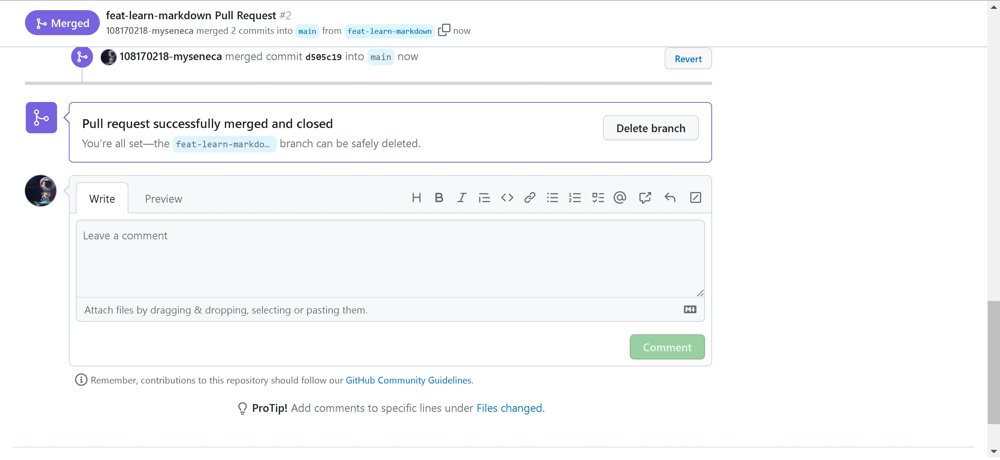

# Checkpoint3 Submission

- **COURSE INFORMATION: CSN400-2234**
- **STUDENT’S NAME: Soufiane Berni**
- **STUDENT'S NUMBER: 108170218**
- **GITHUB USER ID: 108170218-myseneca**
- **TEACHER’S NAME: Atoosa Nasiri**

### Table of Contents
- [PartA - Conflict Management - Overwriting Remote Changes](#parta---conflict-management---overwriting-remote-changes)
- [PartB - Conflict Management - Resetting Local Commit Head](#partb---conflict-management---resetting-local-commit-head)
- [PartC - Conflict Management - Merge Editor](#partc---conflict-management---merge-editor)
- [PartD - Collaboration - Creating a Pull Request](#partd---collaboration---creating-a-pull-request)

### PartA - Conflict Management - Overwriting Remote Changes
Under the `Checkpoin3` i have created a subfolder `conflict-resolution` 
and added files into it. then i have `push` the changes. What color will the text appear? from `red` to `green`

### PartB - Conflict Management - Resetting Local Commit Head
What color will the text be after forcefully overwriting remote changes with local changes? After modifying on `GitHub` the color for `red` to `marron`, 
then i created conflict by updating the color in (local repo) to `darkolivegreen`

### PartC - Conflict Management - Merge Editor
Managing the conflict using the `VSCode` I have `Accept Incoming` and `Accept Current` for the second part. Once i have accepted both changes 
towards `Complete Merge` 

### PartD - Collaboration - Creating a Pull Request

This is my pull request screenshot

